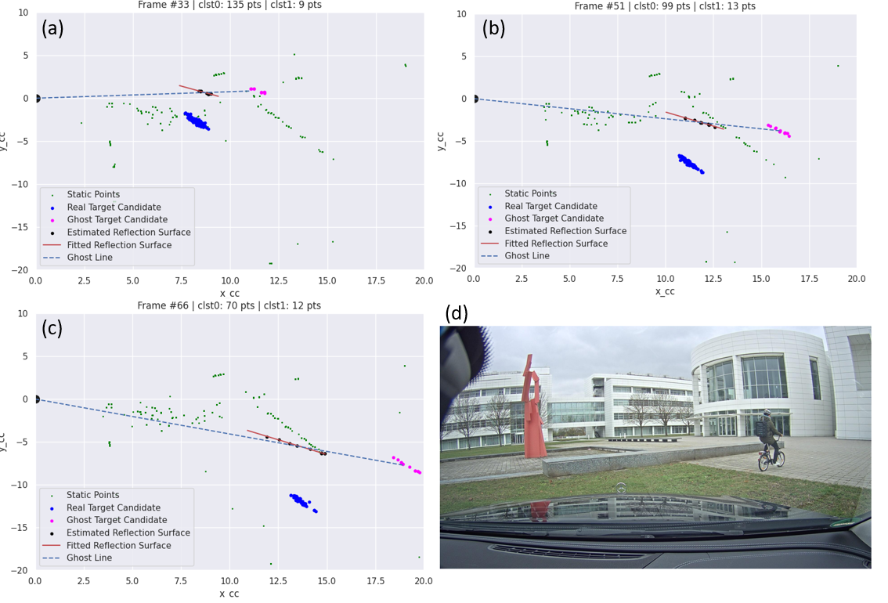
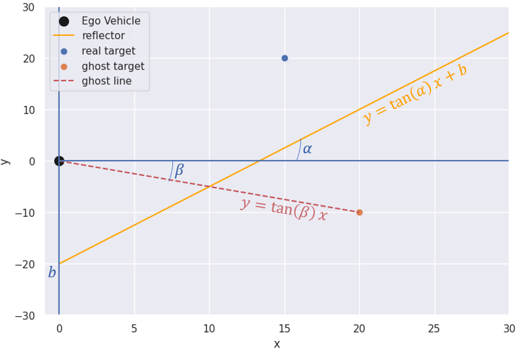

# Radar Multipath Mitigation
This repo is an M.Sc. course project which implements the method described in the article [Multipath Ghost Targets Mitigation in Automotive Environments
](https://ieeexplore.ieee.org/document/9455253) on [The Radar Ghost Dataset](https://ieeexplore.ieee.org/document/9636338). The full method and implementation details are available in the [manuscript](manuscript/Radar_Multipath_Mitigation_Project.pdf).



## Method
The main idea of this method is to examine every 2 range-adjacent targets and measure how well they align with a ghost target model. This is done by estimating the reflective surface between the two targets and measuring various metrics on the estimated surface. The method is illustrated in the figure below.




## Dataset
The radar ghost dataset along with all information regarding structure and usage is available [here](https://zenodo.org/record/6474851).

## Usage
Use `evaluate.py` to run the algorithm on a specific sequence-scenario radar recoding from the ghost dataset.
```
usage: evaluate.py [-h] [--scn SCN] [--seq SEQ] [--side SIDE] [--agg AGG] [--start START] [--end END] [-d]

run multipath mitgation algorithm and save results

optional arguments:
  -h, --help     show this help message and exit
  --scn SCN      scenario to run on
  --seq SEQ      sequence to run on
  --side SIDE    sequence to run on
  --agg AGG      How many radar frames to aggregate
  --start START  start frame
  --end END      end frame
  -d, --debug    use label to get main obj

```

